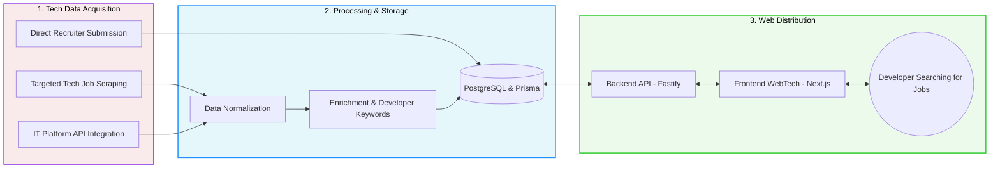

# Road1Job - The Developers' Paradise 💻

**Road1Job** is a job aggregation platform **exclusively dedicated to developers and Tech profiles**. It is designed to centralize, normalize, and showcase the best software engineering opportunities for developers actively searching or open to new opportunities.

---

## 🎯 Objective

Simplify and accelerate the job search process for developers by providing a unique, niche-focused entry point that gathers all relevant tech job offers (from external platforms through scraping, partner APIs, and direct recruiter submissions) into a smooth, dedicated, and clean user interface. No more cluttered searches on generic job boards.

## 👤 Our Targets

- **Developers & IT Profiles (active and passive)**: Frontend, Backend, Fullstack, Mobile developers, DevOps engineers, and Tech professionals looking for a simple platform to find high-quality targeted opportunities without wasting time.
- **Tech Companies & Recruiters**: Startups, consulting firms, and large companies seeking direct access to a specialized and qualified developer audience through an alternative IT recruitment channel.
- **Partner Platforms**: Tech job boards or computer science schools aiming to increase the visibility of their offers through affiliation.

## ⛓️ Value Chain



## 📊 Key Performance Indicators (KPIs)

To measure the platform’s effectiveness, we track:

- **Acquisition & Traffic**: Monthly Active Users (MAU), Daily Active Users (DAU), and developer acquisition rate through SEO/social networks.
- **Content Engagement**: Click-through rate (CTR) on job listings displayed on the dashboard and average session duration.
- **Conversion / Success**: Number of clicks on the "Apply" button (`applyBtnClicks`) and total redirected/submitted applications (CTA).
- **Retention / Loyalty**: Usage of the favorites feature (`favorites`) and returning developer logins.
- **Technical & Product Metrics**: Growth in the number of qualified tech job offers collected daily.

## 💰 Return on Investment (ROI)

- **For Developers**: Massive time savings through an ultra-targeted feed and access to premium or specialized opportunities (reducing frustration during the job search process).
- **For Road1Job (Business)**:
  - *Short term*: Potential monetization of “Featured” placements for recruiters struggling to attract rare tech profiles.
  - *Medium term*: Affiliate revenue (Cost-per-click / Cost-per-Application) toward other aggregators or freelance boards.
  - *Long term*: Sale of a premium B2B Recruiter SaaS Space providing access to company job-view statistics (table `Analytics`).

---

## 🚀 How to Run the Project

The project is fully containerized to simplify the development environment.

### Prerequisites

- :contentReference[oaicite:0]{index=0} and :contentReference[oaicite:1]{index=1} installed on your machine.
- Available ports:
  - `3000` (Next.js)
  - `3001` (Fastify Node.js)
  - `5432` (PostgreSQL)

### 🐳 Full Launch via Docker (Recommended)

1. Move to the project root:

   ```bash
   cd B-YEP-200-RUN-2-1-jobaggregator-3
   ```

2. Install packages:

   ```bash
   cd Backend/
   npm install

   cd road1job_next/
   npm install
   ```

3. Launch with Docker:

   ```bash
   docker compose up --build
   ```

---

## 🌐 Local Access URLs

- **Web Application**: http://localhost:3000
- **API Service**: http://localhost:3001